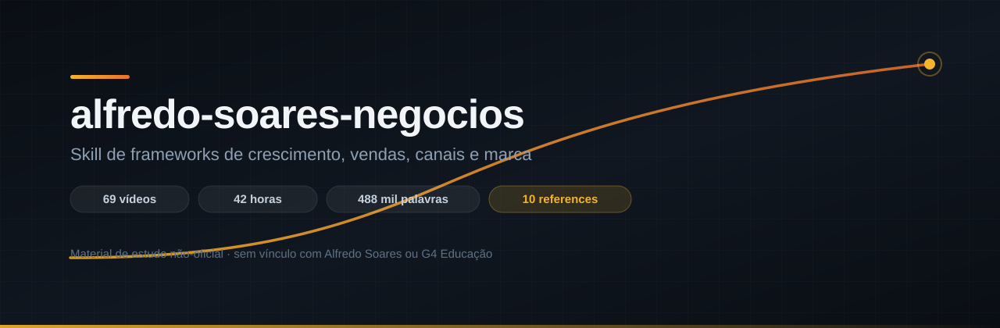

<p align="center">
  
</p>

<p align="center">
  
  
  
  
</p>

# alfredo-soares-negocios

Skill para agentes de IA (Claude Code / Claude Agent SDK) que sistematiza os frameworks de
crescimento, marketing, vendas, canais, parcerias, campanhas, conteúdo e precificação apresentados
por **Alfredo Soares** — co-fundador do G4 Educação, ex-VTEX e fundador da Xtech — no canal
[@canaldoalfredosoares](https://www.youtube.com/@canaldoalfredosoares).

Não é um resumo de vídeos. É um **método operacional**: um roteiro de diagnóstico, seis eixos de
análise, uma máquina de geração de ideias e o modo de entrega que ele usa nas mentorias gravadas.

---

> [!IMPORTANT]
> **Material de estudo não-oficial.** Este repositório não tem qualquer vínculo, patrocínio ou
> endosso de Alfredo Soares, do G4 Educação ou de empresas citadas. É uma sistematização
> independente de conteúdo publicado gratuita e publicamente no YouTube, para fins de estudo.
> Nenhuma transcrição, vídeo ou imagem de terceiros é redistribuída aqui.
> Para o conteúdo original, vá direto ao [canal](https://www.youtube.com/@canaldoalfredosoares).

---

## Índice

- [Instalação](#instalação)
- [Quando a skill dispara](#quando-a-skill-dispara)
- [Como funciona](#como-funciona)
- [Estrutura](#estrutura)
- [Os cinco princípios](#os-cinco-princípios)
- [O que tem em cada reference](#o-que-tem-em-cada-reference)
- [Metodologia](#metodologia)
- [Limitações](#limitações)
- [Atualizar o corpus](#atualizar-o-corpus)
- [Licença e atribuição](#licença-e-atribuição)

---

## Instalação

**Claude Code** — clone dentro da pasta de skills do usuário:

```bash
git clone https://github.com/financeshorts/alfredo-soares-negocios.git ~/.claude/skills/alfredo-soares-negocios
```

No Windows (Git Bash / PowerShell):

```bash
git clone https://github.com/financeshorts/alfredo-soares-negocios.git "$HOME/.claude/skills/alfredo-soares-negocios"
```

Para escopo de projeto, troque o destino por `.claude/skills/alfredo-soares-negocios`.

A skill é reconhecida na próxima sessão. Para verificar, peça algo como *"me ajuda a decidir se lanço
esse produto novo"* — ela deve ser invocada sozinha.

**Sem Claude Code:** os arquivos são Markdown puro. Dá para colar `SKILL.md` + o reference relevante
em qualquer LLM e obter o mesmo efeito.

---

## Quando a skill dispara

Ela é acionada automaticamente em pedidos como:

| Situação | Exemplo de pedido |
|---|---|
| Diagnóstico | "por que meu negócio parou de crescer?" |
| Foco e portfólio | "vale a pena eu abrir essa segunda vertical?" |
| Marketing | "como estruturo o marketing da minha empresa?" |
| Canais e parcerias | "quero montar um programa de parceiros" |
| Campanha | "o que faço na Black Friday esse ano?" |
| Precificação | "estou cobrando certo pela assinatura?" |
| Conteúdo | "vale investir em marca pessoal como founder?" |
| Geração de ideias | "que outros negócios eu poderia tirar da minha base?" |
| Mentoria | "age como advisor e analisa minha empresa" |

---

## Como funciona

A skill segue a sequência das mentorias gravadas:

```
1. DIAGNOSTICAR   →  nunca aconselhar antes dos números
                     (faturamento, margem, ticket, CAC, LTV, ciclo, canal)

2. RODAR OS EIXOS →  carregar só o reference relevante ao caso

3. GERAR IDEIAS   →  11 famílias de movimentos de expansão
                     produzir 3-8 opções...

4. CORTAR         →  ...e matar quase todas, justificando pelo
                     tamanho mínimo e custo de gestão

5. ENTREGAR       →  uma opinião (não um leque), quantificada,
                     com veredito e número para medir em 90 dias
```

O passo 4 é o que separa o método de um brainstorm. Gerar sem cortar não é o método.

---

## Estrutura

```
alfredo-soares-negocios/
├── SKILL.md                              # entrada: princípios, roteiro, roteamento
├── references/
│   ├── diagnostico.md                    # roteiro do quadro "Advisor"
│   ├── arquitetura-de-crescimento.md     # negócio vs empresa, foco, portfólio
│   ├── marketing-e-canais.md             # ICP, funil, mapa de canais
│   ├── vendas-e-parcerias.md             # canal indireto, B2B, eventos
│   ├── campanhas-e-lancamentos.md        # sazonal, promoção, lançamento
│   ├── conteudo-e-marca.md               # autoridade, marca pessoal, colabs
│   ├── dinheiro-e-precificacao.md        # preço, margem, dívida, modelo
│   ├── maquina-de-ideias.md              # 11 famílias de expansão
│   ├── voz-e-estilo.md                   # como ele fala e decide
│   ├── analogias.md                      # biblioteca de metáforas
│   └── fontes.md                         # os 69 vídeos, com links
├── tools/                                # pipeline para reproduzir o corpus
└── assets/
```

**Carregamento progressivo:** só o `SKILL.md` entra em contexto quando a skill dispara. Os references
são lidos sob demanda, conforme o eixo do problema — o que mantém o custo de contexto baixo mesmo com
16 mil palavras de material.

---

## Os cinco princípios

Atravessam praticamente todos os episódios.

### 1. Negócio ≠ empresa
Negócio depende do dono, de um canal ou de um algoritmo — pode faturar muito e acabar quando a
dependência acabar. Empresa tem canal próprio, marca, governança e controle do próprio crescimento.
**Teste:** se o canal principal mudar a regra amanhã, o que sobra?

### 2. Uma coisa ótima > várias coisas boas
A analogia: um galpão de R$ 100 mil de aluguel versus cem salas de R$ 1 mil. Diluir parece seguro,
mas o custo de gestão explode. O que cria valor de mercado é ser relevante em **uma** coisa.

### 3. Se você tem que explicar, o marketing está ruim
Posicionamento que precisa de explicação não é posicionamento. Corolário: marca de holding quase
nunca vende sozinha — invista na marca que o cliente já reconhece.

### 4. A renda complementar mata o canal
O erro clássico de programa de parceiros é transformar o parceiro em vendedor. Ele não coloca energia
por algo que representa 2% da receita dele. A inversão: use-o como **canal e gerador de lead**,
subsidiando o relacionamento dele com o cliente dele.

### 5. Convivência cria janela de oportunidade
Venda B2B complexa não se resolve com acesso — se resolve com acesso **+ endosso + convivência**.
Por isso evento, almoço e comunidade são ferramenta de venda, não de marketing institucional.

---

## O que tem em cada reference

| Arquivo | Destaques |
|---|---|
| **diagnostico.md** | Perguntas literais da sessão · tabela *dor declarada × causa real* · provocações que viram a chave · estrutura do veredito |
| **arquitetura-de-crescimento.md** | Negócio vs empresa e as 6 fortalezas · agrupar antes de somar · régua produto→BU→empresa · a escadinha de patamares · sair do operacional · joint venture |
| **marketing-e-canais.md** | "Todo mundo pode comprar, mas você não vende para todo mundo" · os 4 filtros (fácil/rápido/barato/escalável) · marketing complexo em 3 pilares · mapa de canais · rede de influência · ritual de marketing às segundas |
| **vendas-e-parcerias.md** | Regra da renda complementar · parceiro como canal · pagar por reunião realizada · layout de mesa de evento · venda ativa vs passiva por porte · modelo de negócio como alavanca |
| **campanhas-e-lancamentos.md** | Três públicos de campanha · a conta canal + promoção · mecânicas com gatilho externo · lista VIP sem queimar · anatomia de lançamento · plano de 60 dias · os 5 erros |
| **conteudo-e-marca.md** | Conteúdo IN/OUT · territórios · escada de relevância · capturado vs produzido · estratégia overpost · projeto 1000 ads · sampling como captador de lead |
| **dinheiro-e-precificacao.md** | Valor gerado × percebido · assinatura anual antecipada · revenue share · regra do novo zero · dívida vs alavancagem · CAC/LTV e o terceiro número |
| **maquina-de-ideias.md** | 11 famílias com perguntas-gatilho: cliente como insumo, virar canal para a própria base, custo já pago, ponto de venda dos outros, white label, JV, know-how em produto, hype |
| **voz-e-estilo.md** | O "momento insight" · bordões medidos no corpus · como ele discorda · o que ele **não** faz · como calibrar o tom sem virar imitação |
| **analogias.md** | ~25 metáforas por tema, com quando usar · o padrão para construir uma nova |

---

## Metodologia

O corpus foi montado assim:

1. **Coleta** — legendas públicas (`pt-orig`) dos 69 vídeos da aba *Videos* do canal, via `yt-dlp`.
   Só legenda; nenhum vídeo baixado. Resultado: ~42 horas, **487.747 palavras**.
2. **Limpeza** — remoção de tags de timing, marcadores de falante e da repetição típica das
   *rolling captions*.
3. **Leitura integral** — 12 episódios de maior densidade de ensino, lidos por inteiro, com
   atribuição conferida manualmente. São os marcados como `[lido]` em
   [`references/fontes.md`](references/fontes.md).
4. **Varredura automática** — os outros 57 passaram por extração por padrão, atrás de analogias,
   bordões, gatilhos de geração de ideia e momentos de veredito. Serviu como **pista de onde olhar**,
   nunca como fonte final.
5. **Síntese** — os frameworks foram reescritos como método aplicável, com link do vídeo de origem em
   cada bloco, para que qualquer afirmação seja rastreável.

Os scripts dos passos 1, 2 e 4 estão em [`tools/`](tools/) e reproduzem tudo do zero.

---

## Limitações

Registradas de propósito — importam para usar o material com honestidade.

- **Legendas não identificam quem fala.** Em episódios com convidado, um trecho extraído pode ser do
  entrevistado. Por isso a leitura integral e os gatilhos de advisor foram priorizados.
- **Conteúdo parcialmente comercial.** Ele é sócio do G4 e embaixador de várias marcas. Parte do que
  aparece nos vídeos é publicidade — os frameworks foram separados do merchan, mas vale o olho crítico.
- **Números declarados, não auditados.** A maioria das cifras citadas nos episódios vem do próprio
  empresário entrevistado. Tratar como ordem de grandeza.
- **Viés de repertório.** O material é forte em marketing, vendas, canal e distribuição. Em cultura,
  pessoas e processo é mais raso — ele mesmo se descreve como mais "fazedor de dinheiro" do que
  montador de time.
- **Escopo.** Gestão de PME e scale-up brasileira. Não substitui contabilidade, jurídico ou
  assessoria de investimento.

---

## Atualizar o corpus

O canal publica com frequência. Para reprocessar tudo:

```bash
sh tools/baixar_legendas.sh corpus      # só legendas, com rate limit
python tools/limpar_vtt.py corpus       # vtt -> texto legível
python tools/extrair_padroes.py corpus  # analogias, ideias, vereditos, bordões
```

Detalhes e notas de compatibilidade em [`tools/README.md`](tools/README.md).

---

## Licença e atribuição

**Código** (`tools/`) e **banner** (`assets/`): MIT — veja [LICENSE](LICENSE).

**Conteúdo** (`SKILL.md`, `references/`): sistematização original e interpretativa de ideias
apresentadas publicamente por Alfredo Soares. Frameworks e insights são de autoria dele; a
organização, o texto e a estrutura metodológica são deste repositório. Citações são curtas e
atribuídas, com link para o vídeo de origem.

Nenhuma transcrição, vídeo, imagem, logotipo ou material de marca de terceiros é redistribuído aqui.

Se você é o Alfredo, o G4, ou representa qualquer parte citada e quer ajuste ou remoção:
abra uma issue que eu atendo.

**Crédito onde é devido:** todo o valor intelectual deste repositório vem do conteúdo que ele publica
de graça. Se te for útil, [inscreva-se no canal](https://www.youtube.com/@canaldoalfredosoares).
